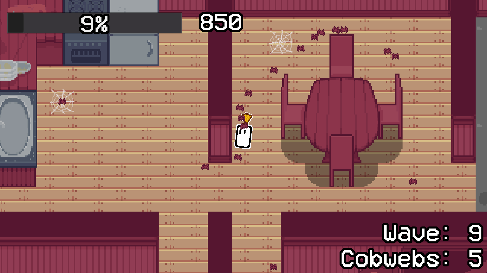

# Sweeper
An infinite arena survival game where you use a broom to whack spiders and cobwebs. Made in Godot 3.5.

## Status
I currently consider this project finished. I don't plan on adding new features and will only be fixing bugs. You can make issues here if you wish, but please keep in mind that I will not fix everything, since I will be working on other projects.

You can report bugs through the [itch.io page](https://lilyyllyyllyly.itch.io/sweeper), or you can make issues and pull requests here on github. If you choose the latter, please keep in mind that I'm very new to this, so I don't know how everything works yet.

If necessary for any reason, you can contact me through email: lilliana.raquel.goncalves@gmail.com (I might take a while to respond)

## Licensing
All images included in this repository use the [CC-BY 4.0](https://creativecommons.org/licenses/by/4.0/) license. The license is available in the [LICENSE-CC-BY](LICENSE-CC-BY) file.

All other files are licensed under the MIT license. See the file [LICENSE](LICENSE).

## Installation
You can get a .zip file for your platform on the [releases](https://github.com/lilyyllyyllyly/Sweeper/releases) section or the [itch.io page](https://lilyyllyyllyly.itch.io/sweeper).

Alternatively, you can clone this repository with the following command:

`git clone https://github.com/lilyyllyyllyly/Sweeper.git`

And open it with [Godot 3.5](https://godotengine.org/download/3.x) (make sure to use the mono version, as this project is made using C#) to export your own build.

## Execution
After extracting the .zip file (see [Installation](installation)), you can run the game with the **Sweeper_\<version-number>** (**.x86_64**, **.exe** or **.html**) file inside the **Linux**, **Windows** or **HTML5** folder depending on your platform (e.g.: Linux/Sweeper_1-5-0.x86_64).

You can also play the game directly in your browser in the [itch.io page](https://lilyyllyyllyly.itch.io/sweeper).

## How to play
Controls:
- Use the WASD keys to move
- Move the cursor to aim
- Hold the left mouse button to charge
- Release the left mouse button to attack

Your goal is to survive as long as possible while killing spiders and destroying cobwebs to increase your score.

You can attack the spiders with your broom to knock them into walls, killing them. They are knocked back futher if you charge longer.

The spiders will constantly appear from the cobwebs, so make sure to destroy them before it gets out of control! (it also gives you a lot of score!)

### UI

\[1]: **Poison bar** - If this bar reaches 100%, you lose.

\[2]: **Score** - Current score of this match.

\[3]: **Wave counter** - Shows the current wave number.

\[4]: **Cobweb counter** - Shows the amount of cobwebs that currently exist.

## Screenshots

